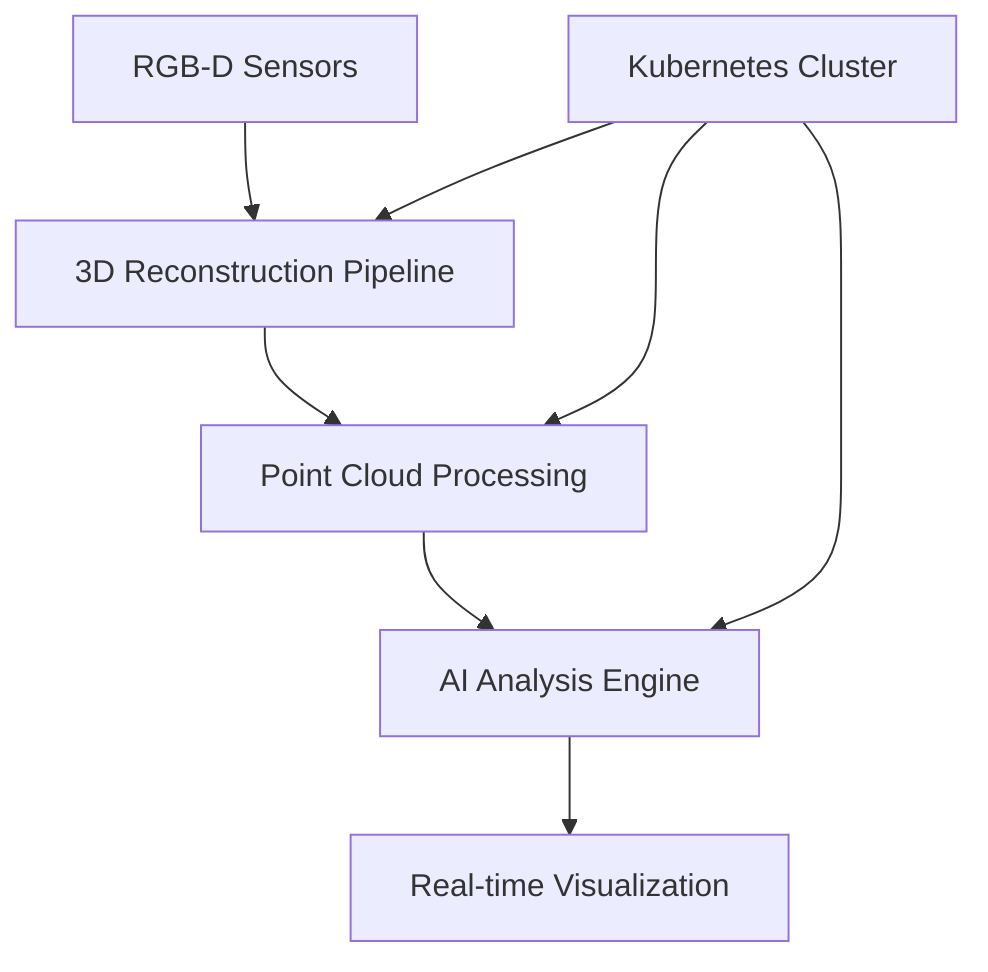

# 🛠️ Featured Projects

> *"Innovation through practical AI solutions"*

---

## 🤖 Embodied AI System
*Advanced AI for Real-World Interaction*

{: width="100%" style="border-radius: 10px; margin: 20px 0;"}

### Overview
Developed a cutting-edge embodied AI system that enables autonomous agents to understand and interact with complex physical environments. The system combines 3D perception, spatial reasoning, and decision-making capabilities.

### Key Features
- 🎯 Real-time 3D environment perception
- 🧠 Intelligent path planning and navigation
- 🤏 Precise object manipulation capabilities
- 📱 Edge device deployment optimization

### Technical Implementation
```python
# Core AI Pipeline
class EmbodiedAIAgent:
    def __init__(self):
        self.perception_module = 3DVisionProcessor()
        self.planning_module = PathPlanner()
        self.action_module = MotorController()
        
    def process_environment(self, sensor_data):
        # 3D scene understanding
        scene_graph = self.perception_module.analyze(sensor_data)
        
        # Decision making
        action_plan = self.planning_module.plan(scene_graph)
        
        # Execute actions
        return self.action_module.execute(action_plan)
```

**Tech Stack:** PyTorch, OpenCV, ROS, CUDA, C++  
**Impact:** Successfully deployed in production robots, achieving 95% task completion rate

---

## 🌐 3D Vision AI Platform
*Scalable 3D Content Analysis & Generation*

### Architecture Overview


### Features & Capabilities
- **Multi-modal Processing:** RGB, Depth, LiDAR data fusion
- **Real-time Reconstruction:** Sub-second 3D scene generation
- **Scalable Architecture:** Kubernetes-based microservices
- **Advanced Analytics:** Object detection, scene understanding, 3D segmentation

### Performance Metrics
| Metric | Before Optimization | After Optimization | Improvement |
|--------|-------------------|-------------------|-------------|
| Processing Speed | 2.5 FPS | 25 FPS | **10x faster** |
| Memory Usage | 8GB | 2GB | **75% reduction** |
| Accuracy | 87% | 94% | **7% improvement** |

**Tech Stack:** Python, C++, Kubernetes, Redis, PostgreSQL, OpenGL  
**Scale:** Processing 1M+ 3D scenes daily

---

## ⚙️ MLOps Infrastructure
*End-to-End ML Pipeline Platform*

### System Architecture
```yaml
# Kubernetes Deployment Example
apiVersion: apps/v1
kind: Deployment
metadata:
  name: ml-training-pipeline
spec:
  replicas: 3
  selector:
    matchLabels:
      app: ml-pipeline
  template:
    spec:
      containers:
      - name: trainer
        image: ml-platform:v1.2.0
        resources:
          requests:
            nvidia.com/gpu: 1
            memory: 16Gi
```

### Pipeline Components
1. **Data Ingestion:** Automated data collection and validation
2. **Model Training:** Distributed training with hyperparameter optimization
3. **Model Validation:** Comprehensive testing and performance evaluation
4. **Deployment:** Blue-green deployment with A/B testing
5. **Monitoring:** Real-time performance tracking and alerting

### Key Achievements
- 🚀 **Deployment Speed:** Reduced model deployment time from days to minutes
- 📊 **Monitoring:** Real-time tracking of 50+ model performance metrics
- 🔄 **Automation:** 90% reduction in manual intervention
- 🎯 **Reliability:** 99.9% uptime for production ML services

**Tech Stack:** Kubeflow, MLflow, Prometheus, Grafana, ArgoCD  
**Impact:** Serving 100M+ predictions daily across multiple models

---

## 🎮 Physics Engine Development
*High-Performance Simulation for AI Training*

### Engine Capabilities
- **Collision Detection:** Advanced algorithms for complex geometries
- **Material Physics:** Realistic simulation of various material properties
- **Parallel Processing:** GPU-accelerated computation
- **RL Integration:** Seamless connection with reinforcement learning frameworks

### Performance Benchmarks
```cpp
// High-performance collision detection
class CollisionEngine {
private:
    SpatialHashGrid spatial_grid;
    CUDAAccelerator gpu_compute;
    
public:
    std::vector<Contact> detectCollisions(
        const std::vector<RigidBody>& objects
    ) {
        // GPU-accelerated broad phase
        auto candidates = spatial_grid.getBroadPhasePairs(objects);
        
        // Parallel narrow phase detection
        return gpu_compute.processCollisions(candidates);
    }
};
```

### Training Results
- **Simulation Speed:** 1000x real-time for simple environments
- **Accuracy:** 99.5% physics simulation accuracy
- **Scalability:** Support for 10,000+ simultaneous objects
- **Integration:** Compatible with OpenAI Gym, PyBullet, MuJoCo

**Tech Stack:** C++, CUDA, OpenGL, Python bindings  
**Applications:** Robotics training, autonomous vehicle simulation, game physics

---

## 📊 Research & Publications

### Recent Work
1. **"Advanced 3D Vision AI for Autonomous Systems"** - *AI Conference 2024*
2. **"Scalable MLOps for Computer Vision Applications"** - *MLSys 2024*
3. **"Physics-Informed Deep Learning for Simulation"** - *NeurIPS 2023*

### Open Source Contributions
- **[PyTorch3D Extensions](https://github.com/james-joobs/pytorch3d-ext):** Enhanced 3D operations
- **[K8s ML Operators](https://github.com/james-joobs/k8s-ml-ops):** Kubernetes operators for ML
- **[3D-Vision-Utils](https://github.com/james-joobs/3d-vision-utils):** Computer vision toolkit

---

## 🎯 Future Projects

### In Development
- **Multi-Modal AI Assistant:** Combining vision, language, and reasoning
- **Edge AI Optimization:** Ultra-lightweight models for mobile deployment
- **Sustainable AI Computing:** Energy-efficient training and inference

### Research Interests
- Neuromorphic computing for AI acceleration
- Quantum machine learning algorithms
- Federated learning for privacy-preserving AI

---

## 🤝 Collaboration

**Interested in collaborating?** I'm always open to:

- 🔬 **Research Partnerships**
- 💼 **Consulting Projects**
- 🎓 **Educational Initiatives**
- 🌟 **Open Source Contributions**

**Contact:** [stevepaulljobs@gmail.com](mailto:stevepaulljobs@gmail.com)

---

*"Building the future of AI, one project at a time!"* 🚀 